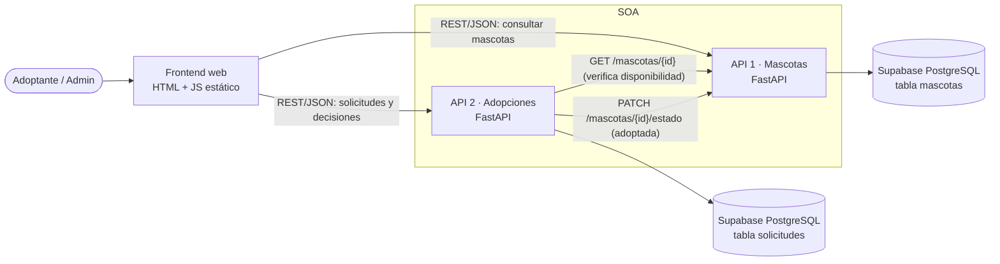
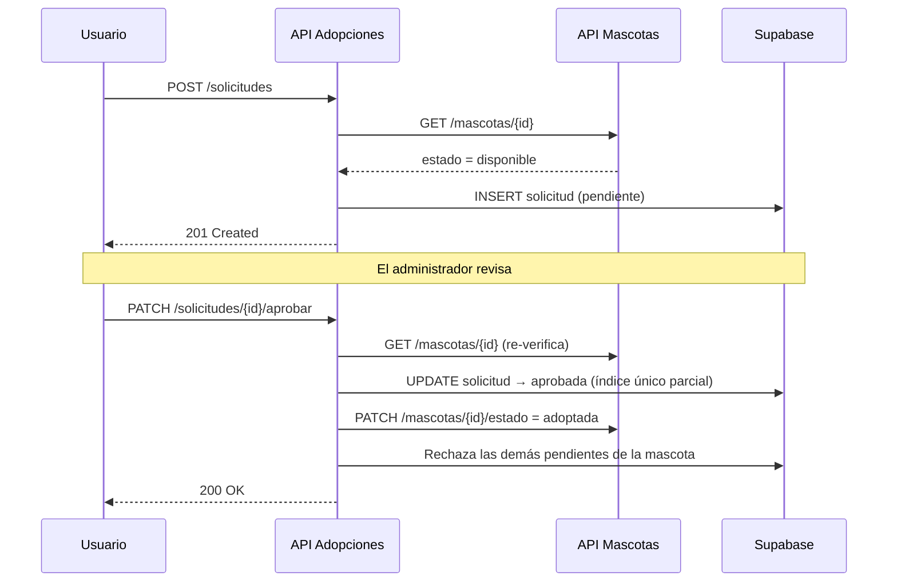

# Diagrama de arquitectura

```mermaid
flowchart LR
    U([Adoptante / Admin]) --> F[Frontend web<br/>HTML + JS estático]
    F -- "REST/JSON: consultar mascotas" --> M
    F -- "REST/JSON: solicitudes y decisiones" --> A
    subgraph SOA
      M["API 1 · Mascotas<br/>FastAPI"]
      A["API 2 · Adopciones<br/>FastAPI"]
    end
    A -- "GET /mascotas/{id} (verifica disponibilidad)" --> M
    A -- "PATCH /mascotas/{id}/estado (adoptada)" --> M
    M --> DB1[(Supabase PostgreSQL<br/>tabla mascotas)]
    A --> DB2[(Supabase PostgreSQL<br/>tabla solicitudes)]
```

## Flujo de adopción

```mermaid
sequenceDiagram
    participant U as Usuario
    participant A as API Adopciones
    participant M as API Mascotas
    participant DB as Supabase
    U->>A: POST /solicitudes
    A->>M: GET /mascotas/{id}
    M-->>A: estado = disponible
    A->>DB: INSERT solicitud (pendiente)
    A-->>U: 201 Created
    Note over U,DB: El administrador revisa
    U->>A: PATCH /solicitudes/{id}/aprobar
    A->>M: GET /mascotas/{id} (re-verifica)
    A->>DB: UPDATE solicitud → aprobada (índice único parcial)
    A->>M: PATCH /mascotas/{id}/estado = adoptada
    A->>DB: Rechaza las demás pendientes de la mascota
    A-->>U: 200 OK
```
